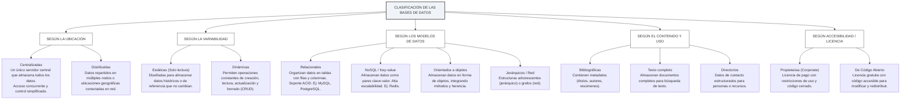

tarea 1.2  cuadro sinoptico de la clasificacion de base de datos

```mermaid
graph TD
    ROOT["CLASIFICACIÓN DE LAS BASES DE DATOS"]

    %% Categorías principales
    ROOT --> C1["SEGÚN LA UBICACIÓN"]
    ROOT --> C2["SEGÚN LA VARIABILIDAD"]
    ROOT --> C3["SEGÚN LOS MODELOS DE DATOS"]
    ROOT --> C4["SEGÚN EL CONTENIDO Y USO"]
    ROOT --> C5["SEGÚN ACCESIBILIDAD / LICENCIA"]

    %% Detalle de Ubicación
    C1 --> U1["Centralizadas<br/>Un único servidor central que almacena todos los datos.<br/>Acceso concurrente y control simplificado."]
    C1 --> U2["Distribuidas<br/>Datos repartidos en múltiples nodos o ubicaciones geográficas conectadas en red."]

    %% Detalle de Variabilidad
    C2 --> V1["Estáticas (Solo lectura)<br/>Diseñadas para almacenar datos históricos o de referencia que no cambian."]
    C2 --> V2["Dinámicas<br/>Permiten operaciones constantes de creación, lectura, actualización y borrado (CRUD)."]

    %% Detalle de Modelos de Datos
    C3 --> M1["Relacionales<br/>Organizan datos en tablas con filas y columnas. Soporte ACID. Ej: MySQL, PostgreSQL."]
    C3 --> M2["NoSQL / Key-value<br/>Almacenan datos como pares clave-valor. Alta escalabilidad. Ej: Redis."]
    C3 --> M3["Orientados a objetos<br/>Almacenan datos en forma de objetos, integrando métodos y herencia."]
    C3 --> M4["Jerárquicos / Red<br/>Estructuras arborescentes (jerárquico) o grafos (red)."]

    %% Detalle de Contenido y Uso
    C4 --> T1["Bibliográficas<br/>Contienen metadatos (títulos, autores, resúmenes)."]
    C4 --> T2["Texto completo<br/>Almacenan documentos completos para búsqueda de texto."]
    C4 --> T3["Directorios<br/>Datos de contacto estructurados para personas o recursos."]

    %% Detalle de Licencia
    C5 --> L1["Propietarias (Corporate)<br/>Licencia de pago con restricciones de uso y código cerrado."]
    C5 --> L2["De Código Abierto<br/>Licencia gratuita con código accesible para modificar y redistribuir."]

    %% Estilos limpios
    style ROOT fill:#f0f4f8,stroke:#333,stroke-width:2px
    style C1 fill:#ffffff,stroke:#333,stroke-width:1px
    style C2 fill:#ffffff,stroke:#333,stroke-width:1px
    style C3 fill:#ffffff,stroke:#333,stroke-width:1px
    style C4 fill:#ffffff,stroke:#333,stroke-width:1px
    style C5 fill:#ffffff,stroke:#333,stroke-width:1px
```
