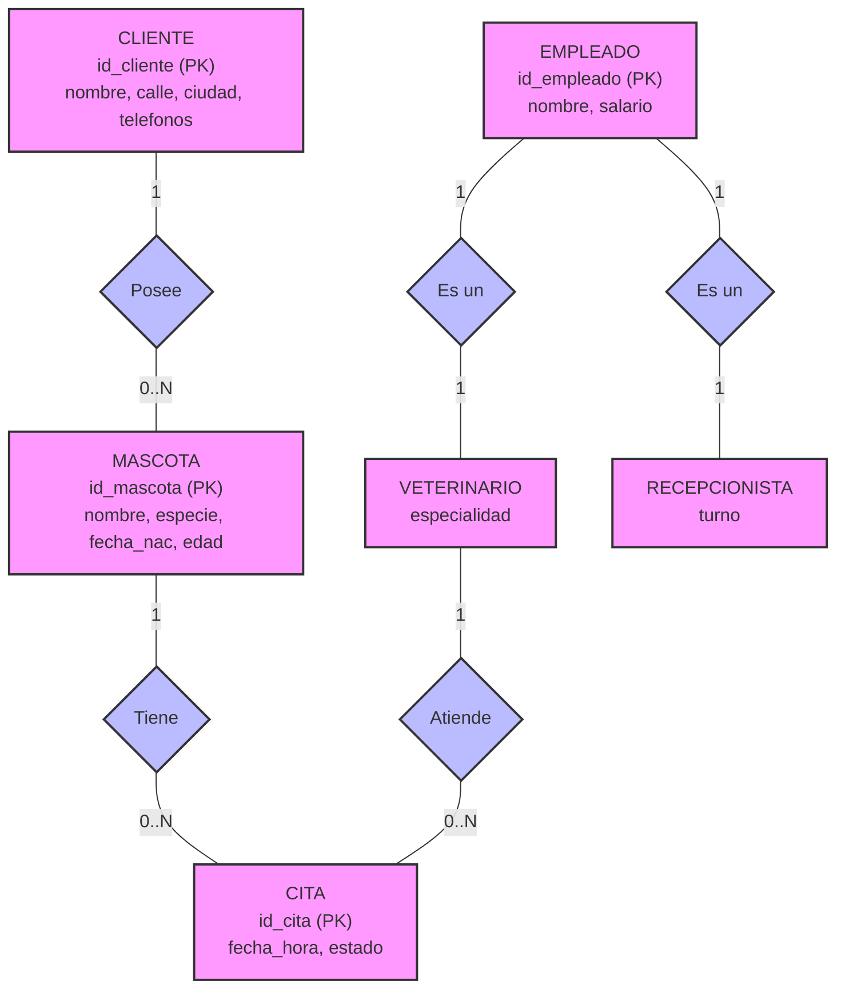

# Modelo Entidad-Relación Extendido (E-RE) — Clínica Veterinaria "Patitas Felices"

```mermaid
flowchart TD
    classDef entidad fill:#f9f,stroke:#333,stroke-width:2px;
    classDef relacion fill:#bbf,stroke:#333,stroke-width:2px;

    Cliente["CLIENTE<br/>id_cliente (PK)<br/>nombre, calle, ciudad, telefonos"]:::entidad
    Mascota["MASCOTA<br/>id_mascota (PK)<br/>nombre, especie, fecha_nac, edad"]:::entidad
    Cita["CITA<br/>id_cita (PK)<br/>fecha_hora, estado"]:::entidad
    Empleado["EMPLEADO<br/>id_empleado (PK)<br/>nombre, salario"]:::entidad
    Veterinario["VETERINARIO<br/>especialidad"]:::entidad
    Recepcionista["RECEPCIONISTA<br/>turno"]:::entidad

    Posee{"Posee"}:::relacion
    Tiene{"Tiene"}:::relacion
    Atiende{"Atiende"}:::relacion
    EsUn1{"Es un"}:::relacion
    EsUn2{"Es un"}:::relacion

    Cliente -- "1" --- Posee
    Posee -- "0..N" --- Mascota

    Mascota -- "1" --- Tiene
    Tiene -- "0..N" --- Cita

    Veterinario -- "1" --- Atiende
    Atiende -- "0..N" --- Cita
    Empleado -- "1" --- EsUn1

    EsUn1 -- "1" --- Veterinario

    Empleado -- "1" --- EsUn2
    EsUn2 -- "1" --- Recepcionista
```
