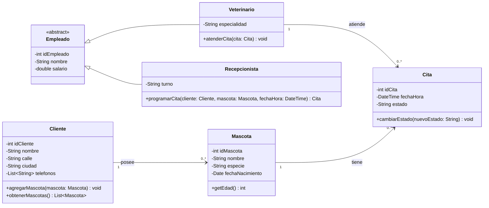

# Diagrama de Clases UML — Clínica Veterinaria "Patitas Felices"

```mermaid
classDiagram
    direction LR

    class Empleado {
        <<abstract>>
        -int idEmpleado
        -String nombre
        -double salario
    }

    class Veterinario {
        -String especialidad
        +atenderCita(cita: Cita) void
    }

    class Recepcionista {
        -String turno
        +programarCita(cliente: Cliente, mascota: Mascota, fechaHora: DateTime) Cita
    }

    class Cliente {
        -int idCliente
        -String nombre
        -String calle
        -String ciudad
        -List~String~ telefonos
        +agregarMascota(mascota: Mascota) void
        +obtenerMascotas() List~Mascota~
    }

    class Mascota {
        -int idMascota
        -String nombre
        -String especie
        -Date fechaNacimiento
        +getEdad() int
    }

    class Cita {
        -int idCita
        -DateTime fechaHora
        -String estado
        +cambiarEstado(nuevoEstado: String) void
    }

    Empleado <|-- Veterinario
    Empleado <|-- Recepcionista
    Cliente "1" --> "0..*" Mascota : posee
    Veterinario "1" --> "0..*" Cita : atiende
    Mascota "1" --> "0..*" Cita : tiene
```
