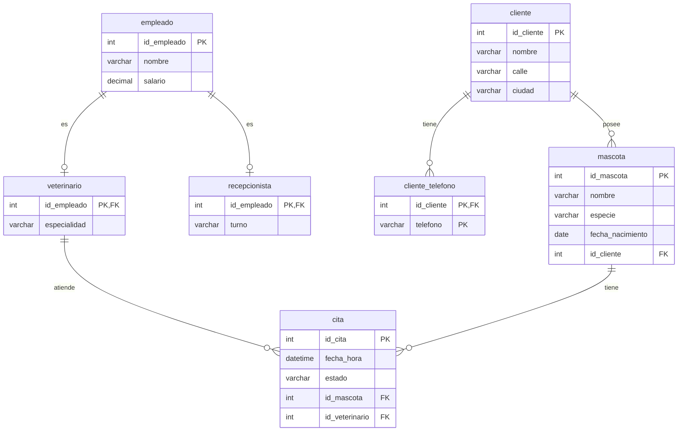

# Esquema Relacional — Clínica Veterinaria "Patitas Felices"

```mermaid
erDiagram
    cita {
        int id_cita PK
        datetime fecha_hora
        varchar estado
        int id_mascota FK
        int id_veterinario FK
    }

    veterinario {
        int id_empleado PK, FK
        varchar especialidad
    }

    recepcionista {
        int id_empleado PK, FK
        varchar turno
    }

    empleado {
        int id_empleado PK
        varchar nombre
        decimal salario
    }

    cliente {
        int id_cliente PK
        varchar nombre
        varchar calle
        varchar ciudad
    }

    cliente_telefono {
        int id_cliente PK, FK
        varchar telefono PK
    }

    mascota {
        int id_mascota PK
        varchar nombre
        varchar especie
        date fecha_nacimiento
        int id_cliente FK
    }

    veterinario ||--o{ cita : "atiende"
    mascota ||--o{ cita : "tiene"
    cliente ||--o{ mascota : "posee"
    cliente ||--o{ cliente_telefono : "tiene"
    empleado ||--o| veterinario : "es"
    empleado ||--o| recepcionista : "es"
```
