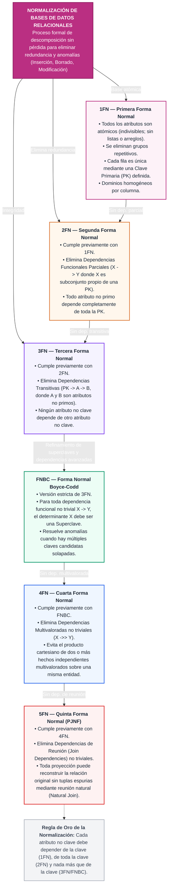

# Mapa Conceptual de Normalización de Bases de Datos Relacionales

```mermaid
flowchart TD
    classDef root fill:#BA2F82,stroke:#8E1E60,stroke-width:2px,color:#FFFFFF;
    classDef fn1 fill:#FDF2F8,stroke:#BA2F82,stroke-width:2px,color:#1F2937;
    classDef fn2 fill:#FFF7ED,stroke:#DB7430,stroke-width:2px,color:#1F2937;
    classDef fn3 fill:#F5F3FF,stroke:#7C3AED,stroke-width:2px,color:#1F2937;
    classDef fnbc fill:#ECFDF5,stroke:#059669,stroke-width:2px,color:#1F2937;
    classDef fn4 fill:#EFF6FF,stroke:#2563EB,stroke-width:2px,color:#1F2937;
    classDef fn5 fill:#FEF2F2,stroke:#DC2626,stroke-width:2px,color:#1F2937;
    classDef regla fill:#F3F4F6,stroke:#9CA3AF,stroke-width:1.5px,color:#374151;

    Norm["<b>NORMALIZACIÓN DE BASES DE DATOS RELACIONALES</b><br/>Proceso formal de descomposición sin pérdida para eliminar redundancia y anomalías (Inserción, Borrado, Modificación)"]:::root

    FN1["<b>1FN — Primera Forma Normal</b><br/>• Todos los atributos son atómicos (indivisibles; sin listas o arreglos).<br/>• Se eliminan grupos repetitivos.<br/>• Cada fila es única mediante una Clave Primaria (PK) definida.<br/>• Dominios homogéneos por columna."]:::fn1

    FN2["<b>2FN — Segunda Forma Normal</b><br/>• Cumple previamente con 1FN.<br/>• Elimina Dependencias Funcionales Parciales (X -&gt; Y donde X es subconjunto propio de una PK).<br/>• Todo atributo no primo depende completamente de toda la PK."]:::fn2

    FN3["<b>3FN — Tercera Forma Normal</b><br/>• Cumple previamente con 2FN.<br/>• Elimina Dependencias Transitivas (PK -&gt; A -&gt; B, donde A y B son atributos no primos).<br/>• Ningún atributo no clave depende de otro atributo no clave."]:::fn3

    FNBC["<b>FNBC — Forma Normal Boyce-Codd</b><br/>• Versión estricta de 3FN.<br/>• Para toda dependencia funcional no trivial X -&gt; Y, el determinante X debe ser una Superclave.<br/>• Resuelve anomalías cuando hay múltiples claves candidatas solapadas."]:::fnbc

    FN4["<b>4FN — Cuarta Forma Normal</b><br/>• Cumple previamente con FNBC.<br/>• Elimina Dependencias Multivaloradas no triviales (X -&gt;&gt; Y).<br/>• Evita el producto cartesiano de dos o más hechos independientes multivalorados sobre una misma entidad."]:::fn4

    FN5["<b>5FN — Quinta Forma Normal (PJNF)</b><br/>• Cumple previamente con 4FN.<br/>• Elimina Dependencias de Reunión (Join Dependencies) no triviales.<br/>• Toda proyección puede reconstruir la relación original sin tuplas espurias mediante reunión natural (Natural Join)."]:::fn5

    ReglaOro["<b>Regla de Oro de la Normalización:</b> Cada atributo no clave debe depender de la clave (1FN), de toda la clave (2FN) y nada más que de la clave (3FN/FNBC)."]:::regla

    Norm -->|"Base atómica"| FN1
    Norm -->|"Elimina redundancia"| FN2
    Norm -->|"Integridad"| FN3

    FN1 -->|"Sin dep. parcial"| FN2
    FN2 -->|"Sin dep. transitiva"| FN3
    FN3 -->|"Refinamiento de superclaves y dependencias avanzadas"| FNBC
    FNBC -->|"Sin dep. multivalorada"| FN4
    FN4 -->|"Sin dep. de reunión"| FN5

    FN5 -.-> ReglaOro
```
